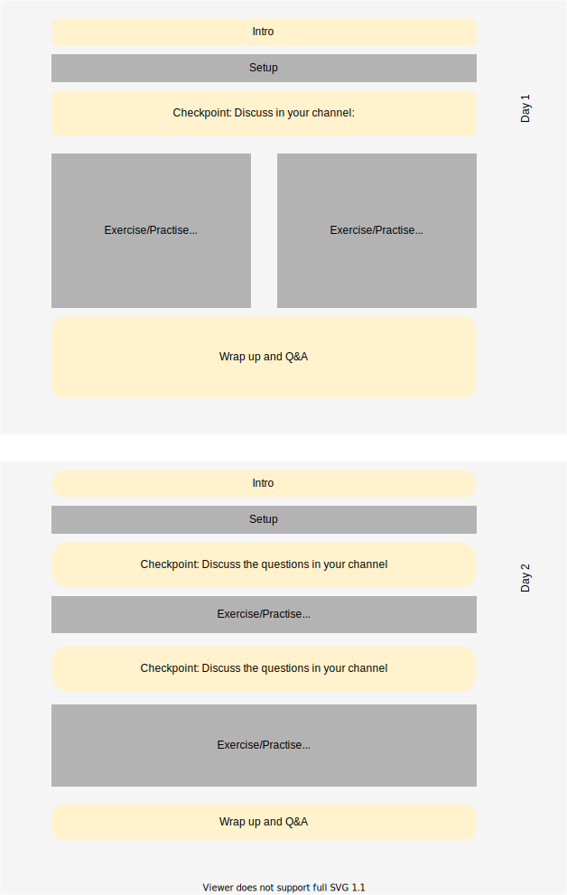

### Table of contents
<!-- TOC depthFrom:2 depthTo:6 withLinks:1 updateOnSave:0 orderedList:0 -->

- [Table of contents](#table-of-contents)
- [Overview](#overview)
- [Background](#background)
- [Day1](#day1)
	- [Objectives](#objectives)
	- [Task 1:](#task-1)
  - [data day 1](#data-day-1)
	- [Task 2:](#task-2)
	- [Task 3:](#task-3)
	- [Task 4:](#task-4)
	- [Wrap up day 1](#wrap-up-day-1)
- [Day 2](#day-2)
	- [Objectives](#objectives)
	- [Data-day-2](#data-day-2)
	- [Task 1](#task-1)
	- [Task2](#task2)
	- [Task3](#task3)
	- [Task4](#task4)
	- [Task5](#task5)
	- [Discussion and Wrap-up.](#discussion-and-wrap-up)

<!-- /TOC -->

### Overview


### Background
Today and tomorrow we will work with sequencing data derived from [_Mycobacterium tuberculosis_](https://en.wikipedia.org/wiki/Mycobacterium_tuberculosis).
 _Mycobacterium tuberculosis_ is a pathogenic bacteria, and the causative agent of [tuberculosis](https://en.wikipedia.org/wiki/Tuberculosis), a bacterial disease that kills about [1.2 million people annually](https://www.who.int/tb/publications/global_report/en/), making it the leading cause of death among infectious diseases.
 Since the treatment of tuberculosis requires sustained use of antibiotics, the rise of  multiple drug-resistant tuberculosis (MDR-TB) and extensively drug-resistant tuberculosis (XDR-TB) provides a serious concern for world health.

We will work with several "patient derived samples": strains that have been either sampled from patients where the disease responded well to antibiotic treatment, or from patients with a more problematic disease progression, where the infection did not respond to first-line antibiotics.

## Day1  

### Objectives
 - practise/re-use what you've learned yesterday on a different dataset. If anything was unclear yesterday, now is the time to catch up on that.
 - get a vague insight into how different data requires different treatment.
 - transition _"from copy-pasting magic incantations"_ to _"using tools that i can adapt to my data"_.
 - gain increased familiarity with some of the basic dataformats and handling them, using simple command line tools.
 - learn how this practical connects to real research.


### Task 1:  
SSH into Rackham and request a interactive session, like you did yesterday.

<details><summary>tips</summary>
<p>

```bash
ssh -Y <user_name>@rackham.uppmax.uu.se
interactive -A g2020004 -t 4:00:00
```
</p>
</details>


<br>
<br>

## data day 1
We have prepared a directory with **.fastq** files from **100** samples:  
```/proj/g2020004/nobackup/ngsworkflow/day3and4/data ```

each sample consists of two files, containing the forward and reverse reads.
they follow the naming scheme   ```SampleID.DIRECTION.FILEENDING```.
for example, sample **01200211Eth2Res120** , will look like this:

```
01200211Eth2Res120.forward.fq
01200211Eth2Res120.reverse.fq
```
In the same folder, you will also find the reference file:

```Mycobacterium_tuberculosis_h37rv.ASM19595v2.dna.chromosome.Chromosome.fa```
which you will need for alignment.


### Task 2:
pick two samples (so, 4 files) and [copy](https://linux.die.net/man/1/cp) or [simlink](https://ss64.com/bash/ln.html) them to your home directory.

**Questions:**

 - _How does this data differ from the one that you worked on before?_
 -  _Do you think you will be able to use the GATK BSQR tool on this dataset?_
 - _Can you figure out how many reads there are in one file?_
<details><summary>tips</summary>
    <p>

 [ the fastq format](https://en.wikipedia.org/wiki/FASTQ_format)  
 [grep](http://man7.org/linux/man-pages/man1/grep.1.html)  
 [wc -l](https://ss64.com/bash/wc.html)
 </p>

 </details>

 <br>
 <br>


### Task 3:

Generate GVCF files from your samples, using the Software and steps from Day 1&2

**Alternatively:**  
 Generate GVCF files from many samples using a [bash-script with for-loops, variables and string manipulation](./bash_scripting_day1.md)

**NB:**
 - you will have to omit the BSQR step.
 - you need to run HaplotypeCaller with the ``-ploidy 1`` option.

  - **optional**: have a look at the [HaplotypeCaller API](https://gatk.broadinstitute.org/hc/en-us/articles/360036712151-HaplotypeCaller) ([API](https://en.wikipedia.org/wiki/Application_programming_interface) = **A**pplication **P**rogramming **I**nterface).
    Here you can find out what options are available and what they do. You dont need to know or understand any of them for now, but keep in mind that there are a lot of gears/choices hidden behind the default options.


### Task 4:

copy the generated GVCF files into the folder folder below!  

```/proj/g2020004/nobackup/ngsworkflow/day3and4/data```

We will run joint variant-calling on it, to generate the VCF file that we will use tomorrow.
Add an identifier to the filenames, so you will be able to recognise them tomorrow (optional).


### Wrap up day 1

- #### What are the main take-away messages?
- #### which of these are relevant to the exam?
- #### How does this relate to the real world? (and our research?)

---
## Day 2

### Objectives
- familiarise yourself with the VCF file-format
- Discuss the variant data by plotting and clustering the genotype matrix.
- familiarise yourself with BCFtools/htslib for filtering, modifying and analysing Variant data.
- investigate between-group allele-frequency-differences to identify candidate regions.  

### Data-day-2
Today we will work with the VCF file containing the samples that you processed yesterday.

### Task 1
- copy the VCF-file from the folder below into your working directory.
```
/proj/g2020004/nobackup/ngsworkflow/day3and4/data/Mt_h37rv.vcf
```
- in the folder ```/proj/g2020004/nobackup/ngsworkflow/``` is a subfolder called ```scripts``` containing some premade scripts for you to use. copy the whole folder into your project directory. you can do this the same way as for the vcf-file, except you will need to add the ```-r```(recursive) flag to your ```cp```-command, in order to also copy the folders contents.

- in the scripts folders is a bash script called ```load_modules.sh``` that contains all the modules you will need for today. you will need to run this at the beginning of each session to make sure you have access to the tools we will use.

- inspect the VCF file manually. you can use ```cat```, ```less```, ```head``` and ```grep``` for this.
  - If you're not sure what any of these do, you can read the [man page](https://en.wikipedia.org/wiki/Man_page) for these tools or google them.
  - You can also have a look at the [official specifications for vcf-fileformat 4.2](https://samtools.github.io/hts-specs/VCFv4.2.pdf).
- *can you spot a general structure?*
- *what do columns and rows represent?*
- *can you tell how many samples there are?*

  - <details><summary>tips</summary>

      <p>
        dirty and fast: grep the header-line containing the sample-names, count them.  <br>
        clean: there's a BCFtools functionality that outputs a list of sample-names. e.g. bcftools query -l file.bcf | wc -l

      </p>

   </details>


### Task2
Plot the variants as a heatmap.
we have made a small script that does this for you, called ```plot_heatmap.py```that you can find in the scripts folder. This file is a small python script that you can run just like any bash-script, except that you will use python3 to execute it. it has only one option, which you can see when looking for the help-message:
```bash
 [in]: python3 plot_heatmap.py --help
[out]: usage: plot_heatmap.py [-h] -i INPUT_VCF

       plot a heatmap

       optional arguments:
       -h, --help                           show this help message and exit
       -i INPUT_VCF, --input_vcf INPUT_VCF  path/to/input.vcf

```
If you are curious, you can look at the script in detail [here](https://github.com/troe27/UU-NGS02/blob/master/premade_scripts/make_heatmap.py).
( I tried my best to annotate it. Also, there are much easier ways of plotting, they're just not installed on the server by default.)


**Questions:**
 - _What do the X and Y axis represent?_
 - _Why did we only put "beginning" and "end" as X-axis labels?_
 - _What do the colours mean? can you guess from the context?_
 - _Can you identify duplicate samples?_
 - _How many samples do you need to identify a causative region?_
 - _Can you already spot something interesting?_


### Task3
For the Third task, we are going to split the VCF into multiple groups corresponding with their phenotype, using BCFtools.


**Questions:**

- _Why are we comparing specific sub-phenotypes, and not just simple/complicated disease progression ?_


**tasks:**
- Extract "wildtype" and "resistant" samples-lists for a category/treatment of your choice from the table using the supplied bash script ```get_samples.sh```. Look at it using ```cat``` or  ```less``` to figure out what input it needs.  
- split the vcf file into two files, using [```bcftools view -S  ```](http://samtools.github.io/bcftools/bcftools.html#view) and the generated lists.

### Task4
For the fourth task, we will then look at the difference in allele-frequency for each variant between groups to identify interesting variants.

**Questions:**
- _Do you know what is meant with allele-frequency?_
- _Do you have an idea why we look at allele-frequency difference and not presence/absence of variants between groups ?_
- _What does a high or low allele-frequency difference between two groups mean in this case?_
- _What could it also mean?_

**Tasks:**
For both files, extract allele-frequencies using BCFtools.
compute and plot the allele-frequency delta using the provided script ```make_delta_af.py```. you can look at the code [here](https://github.com/troe27/UU-NGS02/blob/master/premade_scripts/make_delta_af.py)


### Task5

**Questions:**
- Having found a potential region of interest, how would you investigate it for functional connections to the phenotype at hand, using the tools you learned about in this module or before?
- Speculate: What event did you think lead to the acquisition of resistance?

**Tasks:**
Check your hypothesis!

<details><summary>tips</summary>


You can use IGV to investigate the gene annotations for a given region. For this, you need to open IGV, then load the reference genome and the annotation file ( ```.gff```).  
Alternatively,  you can annotate the vcf using SnpEff, then look at the position with grep (section 6 and 7 of your previous practical).

</details>


### Discussion and Wrap-up.
- #### Q&A
- #### What are the main take-away messages?
- #### which of these are relevant to the exam?
