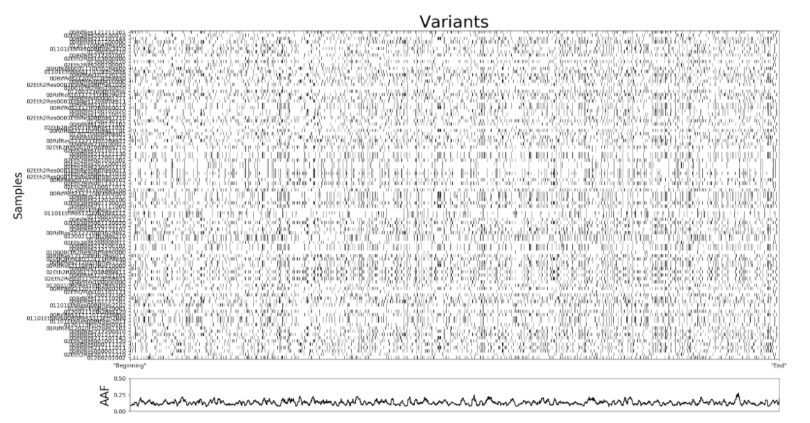

## Day 2

### Objectives
- Familiarise yourself with the VCF file-format
- Discuss the variant data by plotting and clustering the genotype matrix.
- Familiarise yourself with BCFtools/htslib for filtering, modifying and analysing Variant data.
- Investigate between-group allele-frequency-differences to identify candidate regions.  

### Data-day-2
Today we will work with the VCF file containing the samples that you processed yesterday.

### Task 1
- Copy the VCF-file from the folder below into your working directory.
```
/proj/g2021009/private/computer_practicals/NGS_workflow_day3_4/data/Mt_h37rv.vcf
```
- In the folder ```/proj/g2021009/private/computer_practicals/NGS_workflow_day3_4``` is a subfolder called ```scripts``` containing some premade scripts for you to use. copy the whole folder into your project directory. you can do this the same way as for the vcf-file, except you will need to add the ```-r```(recursive) flag to your ```cp```-command, in order to also copy the folders contents.

- Today you will need to load a large amount of libraries - most of them dependencies of other libraries.
the easiest way to deal with this is to just copy&paste the codeblock below into the commandline:

```bash
module load python3/3.7.2
module load bioinfo-tools
module load bcftools
module load biopython/1.76-py3
module load CDO/1.9.5
module load GOTM/5.3-221-gac7ec88d
module load Rosetta/3.7
module load deal.II/9.1.1-gcc
module load deal.II/9.1.1-intel
module load cyvcf2/0.11.5-intel-2019a
module load matplotlib/3.0.3-foss-2019a-Python-3.7.2
```

- Inspect the VCF file manually. you can use ```cat```, ```less```, ```head``` and ```grep``` for this.
  - If you're not sure what any of these do, you can read the [man page](https://en.wikipedia.org/wiki/Man_page) for these tools or google them.

  - You can also have a look at the [official specifications for vcf-fileformat 4.2](https://samtools.github.io/hts-specs/VCFv4.2.pdf).
- *Can you spot a general structure?*
	> Vcf-files follow the general structure:  
	> Header ( prefaced with double-hashes ##). This contains meta-information about the file  
	> Column-names ( prefaced by a single hash #)  
	> Rectangular table containing the genotype information  


- *What do columns and rows represent?*
	> Rows represent variants ( snps/indels)  
	> Columns are either info-fields ( describing the variant across all individuals)  
	> or samples ( describing wether the individual carry the variant or not, as well as other information)  

- *Can you tell how many samples there are?*

  - <details><summary>tips</summary>

      <p>
        Dirty (and fast to write, does not need any tool installed): grep the header-line containing the sample-names, count them.  <br>
        clean: there's a BCFtools functionality that outputs a list of sample-names. e.g. bcftools query -l file.vcf | wc -l <br>
		What is grep doing that make it a really bad idea to use on real data?  
		> grep searches the entire file for the search pattern, since it doesnt know what it is looking for. on real (large) data, this can take many minutes, whereas a data-aware tool like BCFtools takes less than a second, since it knows where to look.
      </p>

   </details>


### Task2
Plot the variants as a heatmap.
We have made a small script that does this for you, called ```make_heatmap.py```that you can find in the scripts folder. This file is a small python script that you can run just like any bash-script, except that you will use python3 to execute it. It has only one option, which you can see when looking for the help-message:
```bash
 [in]: python3 make_heatmap.py --help
[out]: usage: make_heatmap.py [-h] -i INPUT_VCF

       plot a heatmap

       optional arguments:
       -h, --help                           show this help message and exit
       -i INPUT_VCF, --input_vcf INPUT_VCF  path/to/input.vcf

```
If you are curious, you can look at the script in detail [here](https://github.com/troe27/UU-NGS02/blob/master/premade_scripts/make_heatmap.py).
( I tried my best to annotate it. Also, there are much easier ways of plotting, they're just not installed on the server by default.)

> ``` python3 make_heatmap.py -i /path/to/input.vcf ```  
> if you get a "matplotlib not found" error or such, try reloading the entire module block.  
> this is due to how dependencies are handled for python libraries within the module system. lets say its not optimal. I would always recommend a package & virtual environment manager like Conda instead!  



> figure should look like this, approximately  


**Questions:**
 - _What do the X and Y axis represent?_  
>X-axis are variants, Y-axis are samples  

 - _Why did we only put "beginning" and "end" as X-axis labels?_  
 >The X-axis is not continuous. These are just the sites, so between any two ticks there might be a very variable space in terms of base pairs. Unless you write the position of every site, putting values on the X-axis might imply that it is a continous linear scale, which it is not.  

 - _What do the colours mean? can you guess from the context?_  
 > "colors" here are black and white, and represent presence ( black) and absence ( white) of a variant.
 > remember, these are haploids, so there are no heterozygotes!  

 - _Can you identify duplicate samples?_  
 	 > there might be duplicate samples if several students picked the same samples to work with. you can technically identify them by an identical pattern of variants, but it might be difficult here.  

 - _How many samples do you need to identify a causative region?_  
 	> this is a tricky question that has no definitive answer, since it highly depends on how similar or dissimilar your individuals are genetically, as well as how clean your phenotypes are.  
	> assuming your samples have a clear binary phenotype and are only different in _one_ region of the genome: two.
	> The goal here is to contemplate on how this changes if, for example, there are many more variants that are either shared or not shared between samples, or if there are different variants that can result in the same phenotype.

 - _Can you already spot something interesting?_  
 	> there is lots of things to spot and discuss in this figure, and it is great to spot mistakes or faults with the data ( batch effects? population structure/ lineage effects?) but regarding the question at hand: no, it is difficult to spot anything interesting without the help of summary statistics.  


### Task3
For the third task, we are going to split the VCF into multiple groups corresponding with their phenotype, using BCFtools.


**Questions:**

- _Why are we comparing specific sub-phenotypes, and not just simple/complicated disease progression ?_
 > As a general rule: The tighter the phenotype maps to a genetic element, the higher your power in finding that genetic element.  

> For an example: if you want to find genetic loci that create chicken with a high amount of muscle mass, you usually  use body weight as your phenotype, since it is easy to measure. But many other phenotypes will hitchhike on this, and confound your analysis. ( heavier bones, heavier feathers, desire to eat more, higher water content in tissue, for example.)  

> Here, we would compare samples that are antibiotic resistant for many different reasons against those that are not. In combination with population structure or lineage effects, that would mean that the given allele would never have a high enough allele-frequency difference between populations in order to show up in our scan.  


**tasks:**
- Extract "wildtype" and "resistant" samples-lists for a category/treatment of your choice from the table using the supplied bash script ```get_samples.sh```. Look at it using ```cat``` or  ```less``` to figure out what input it needs.  
- Split the vcf file into two files, using [```bcftools view -S  ```](http://samtools.github.io/bcftools/bcftools.html#view) and the generated lists.

> get_samples.sh has two positional inputs: the file and a search term for the resistance:  
> here, the three resistances are **Rif, Eth and Eth2**  
> if we were to pick Rif, the command would be as such:  
> ``` bash get_samples.sh /path/to/file.vcf Rif ``  
> you can then use the resulting lists to split the vcf-file:  
> ``` bcftools  view -S rif.wild.sampleList.txt /path/to/file.vcf > rif.wild.vcf ```  
> ``` bcftools  view -S rif.resistant.sampleList.txt /path/to/file.vcf > rif.res.vcf ```  

### Task4
For the fourth task, we will then look at the difference in allele-frequency for each variant between groups to identify interesting variants.

**Questions:**
- _Do you know what is meant with allele-frequency?_  
 > Here we mean the frequency of the alternative allele - which fraction of the population carries it  

- _Do you have an idea why we look at allele-frequency difference and not presence/absence of variants between groups ?_  
	> It is much more robust to perturbations in your phenotypic or genotypic data.  
	> Imagine there is one sample, that by pure chance or error in experimental design shows a high resistance even if it is not - if we were to look at only presence/absence of variants, all “private” variants ( only carried by this sample) would be suddenly candidates, and all variants that these false resistant sample shares with the nonresistant ones would be ruled out.  


- _What does a high or low allele-frequency difference between two groups mean in this case?_  
	> High: the two groups ( resistant and nonresistant) are, on average, very different from each other at this site, making this site a good candidate for a causative region.  
	> Low: the two groups are, on average, very similar to each other at this site, making it unlikely to be a causative region.

- _What could it also mean?_  
	> Relatedness, e.g. shared variation by descent.  

**Tasks:**
For both files, extract allele-frequencies using BCFtools.
compute and plot the allele-frequency delta using the provided script ```make_delta_af.py```. you can look at the code [here](https://github.com/troe27/UU-NGS02/blob/master/premade_scripts/make_delta_af.py)  

  


### Task5

**Questions:**
- Having found a potential region of interest, how would you investigate it for functional connections to the phenotype at hand, using the tools you learned about in this module or before?
- Speculate: What event did you think lead to the acquisition of resistance?  
	> here, the likeliest scenario is a Point mutation in a gene where the product is either targeted by the antibiotic or involved in the defense against it.  
	> e.g.  RifRes  761400  [link](https://www.sciencedirect.com/science/article/pii/S0732889300002005?via%3Dihub#FIG1)  


**Tasks:**
Check your hypothesis!


<details><summary>tips</summary>


You can use IGV to investigate the gene annotations for a given region. For this, you need to open IGV, then load the reference genome and the annotation file ( ```.gff```).  
Alternatively,  you can annotate the vcf using SnpEff, then look at the position with grep (section 6 and 7 of your previous practical).

</details>


### Discussion and Wrap-up.
- #### Q&A
- #### What are the main take-away messages?
- #### which of these are relevant to the exam?
