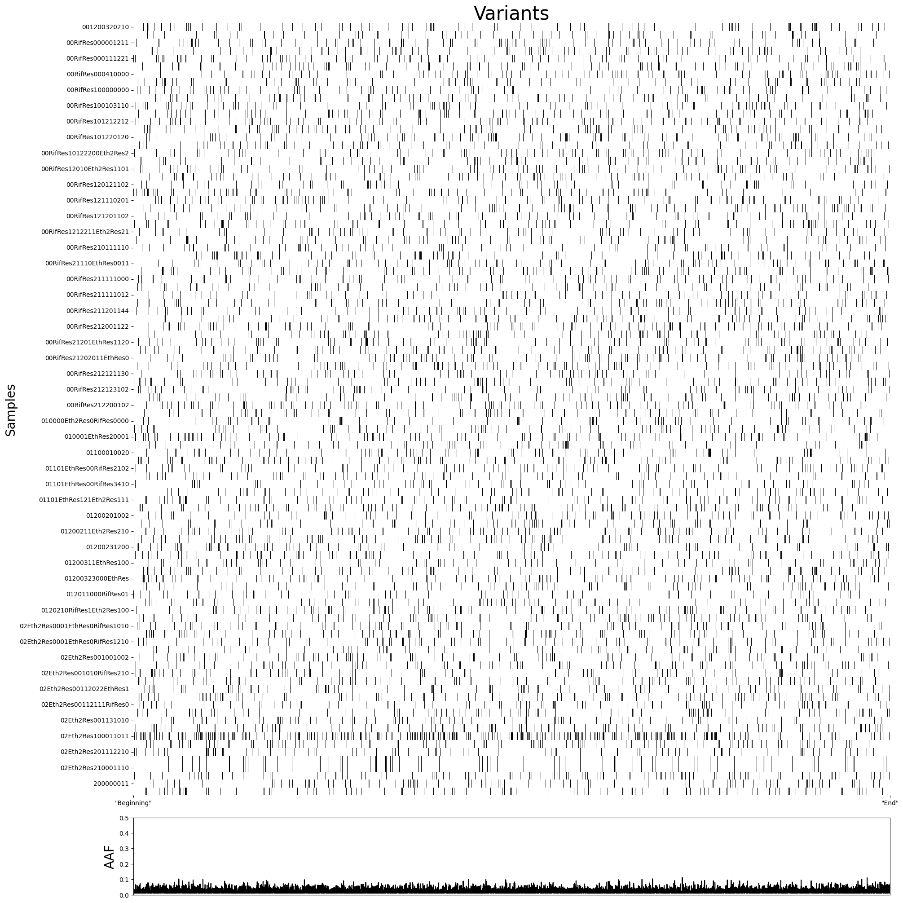
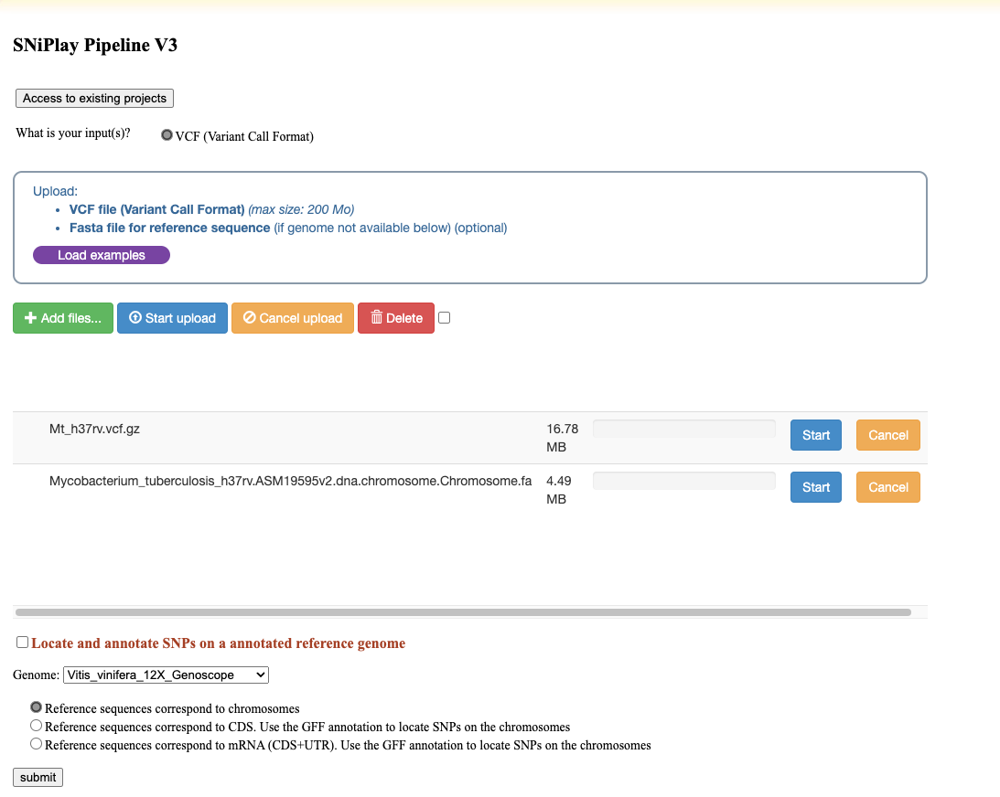
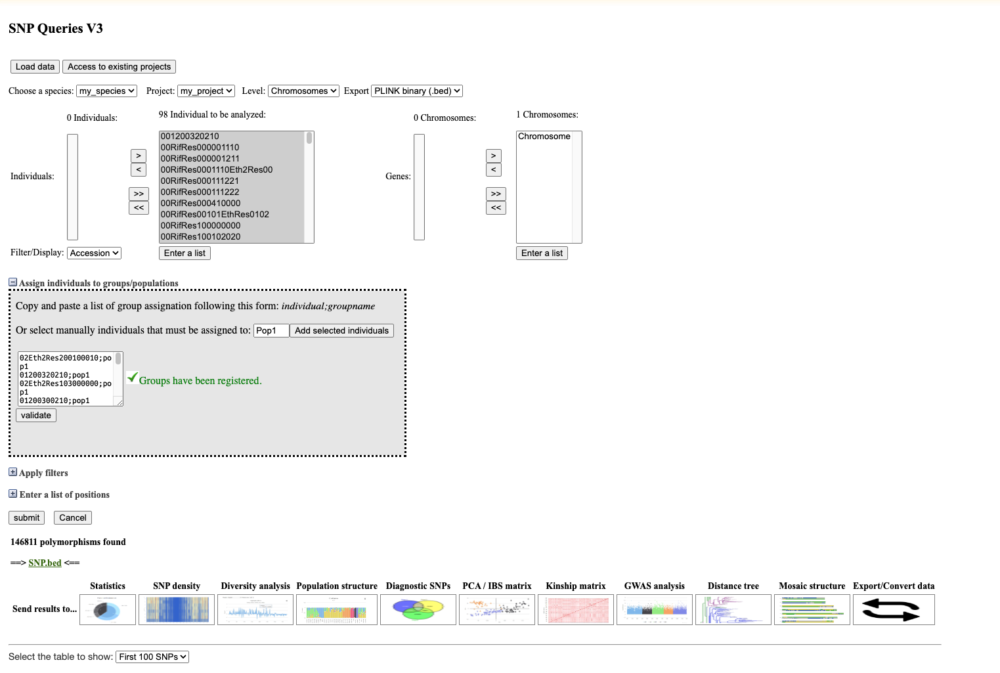
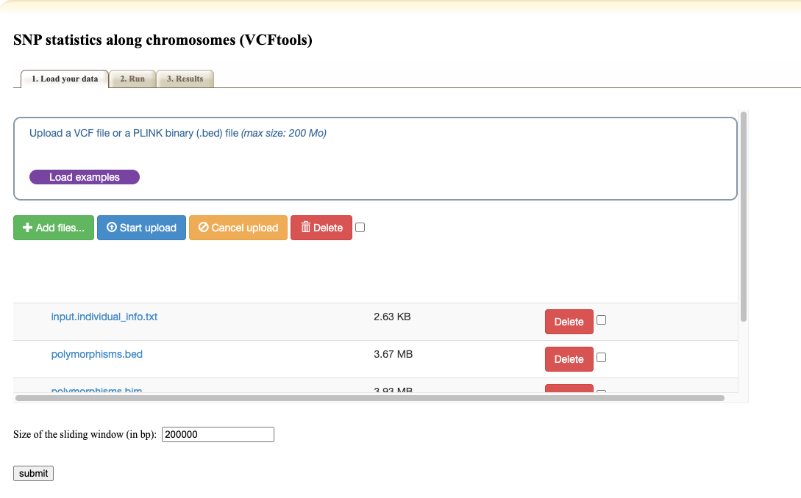
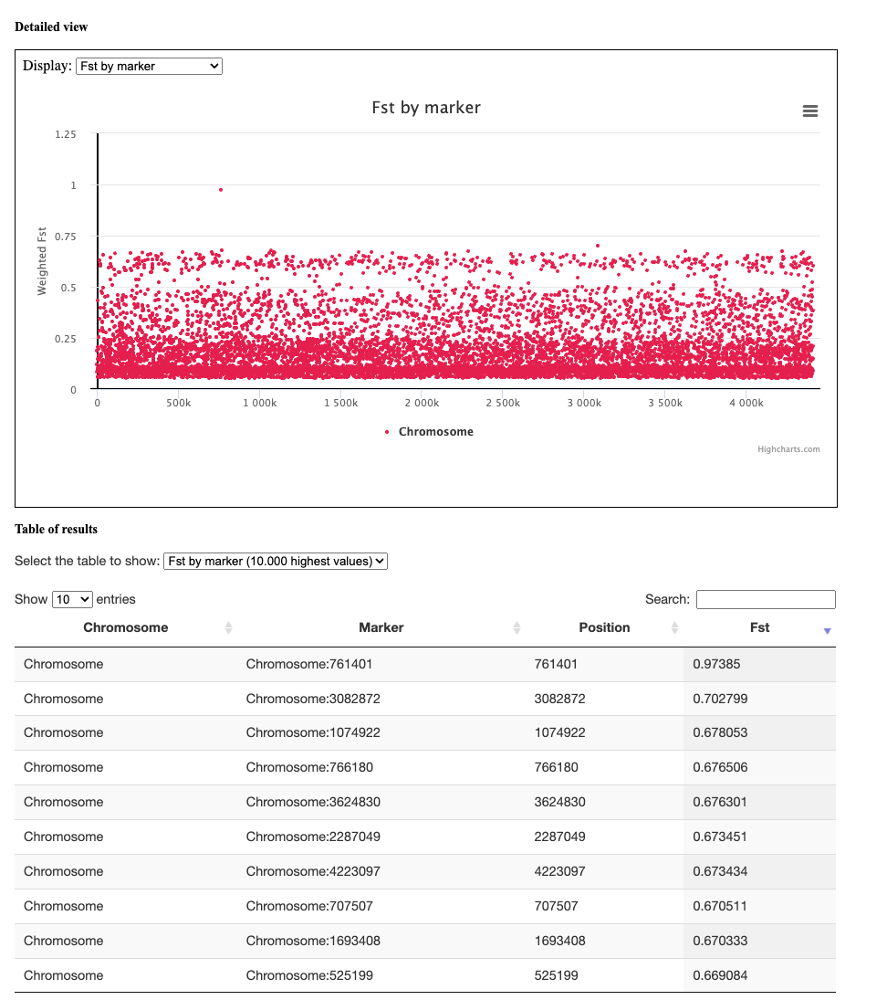

## Day 2

### Objectives
- Familiarise yourself with the VCF file-format
- Discuss the variant data by plotting and clustering the genotype matrix.
- Familiarise yourself with BCFtools/htslib for filtering, modifying and analysing Variant data.
- Investigate between-group allele-frequency-differences to identify candidate regions.  

### Data day 2
Today we will work with the VCF file containing the samples that you processed yesterday.

### Task 1
- Copy the VCF-file from the folder below into your working directory.
```
/proj/g2020004/private/computer_practicals/NGS_workflow_day3_4/data/Mt_h37rv.vcf
```


- Today you will need to load two  libraries one being bcftools and the other the underlying dependency.
the easiest way to deal with this is to just copy&paste the codeblock below into the commandline:

```bash

module load bioinfo-tools
module load bcftools

```

- Inspect the VCF file manually. you can use ```cat```, ```less```, ```head``` and ```grep``` for this.
  - If you're not sure what any of these do, you can read the [man page](https://en.wikipedia.org/wiki/Man_page) for these tools or google them.
  - You can also have a look at the [official specifications for vcf-fileformat 4.2](https://samtools.github.io/hts-specs/VCFv4.2.pdf).
- *Can you spot a general structure?*
> Vcf-files follow the general structure:  
> Header ( prefaced with double-hashes ##). This contains meta-information about the file  
> Column-names ( prefaced by a single hash #)  
> Rectangular table containing the genotype information

- *What do columns and rows represent?*
> Rows represent variants ( snps/indels)  
> Columns are either info-fields ( describing the variant across all individuals)  
> or samples ( describing wether the individual carry the variant or not, as well as other information)  
- *Can you tell how many samples there are?*


<details>
			<summary>tips</summary>
			<p>
        **Dirty:** (and fast to write, does not need any tool installed): grep the header-line containing the sample-names, count them.  <br>
        **Clean**: there's a BCFtools functionality that outputs a list of sample-names. e.g. bcftools query -l file.vcf | wc -l <br>
		What is grep doing that make it a really bad idea to use on real data?
    > grep searches the entire file for the search pattern, since it doesnt know what it is looking for. on real (large) data, this can take many minutes, whereas a data-aware tool like BCFtools takes less than a second, since it knows where to look.
      </p>

  	</p>

   </details>


### Task2
Have a look at the VCF as a graphical representation/heatmap.
Since it is bit tricky to plot and display figures on Rackham when you are just starting out, we have created the figure and added it below. If you are curious, you can look at the code that created it in detail [here](UU_NGS_heatmap.html). (It is annotated, but in Python).




**Questions:**
 - _What do the X and Y axis represent?_
 >X-axis are variants, Y-axis are samples  

 - _Why did we only put "beginning" and "end" as X-axis labels?_

  >The X-axis is not continuous. These are just the sites, so between any two ticks there might be a very variable space in terms of base pairs. Unless you write the position of every site, putting values on the X-axis might imply that it is a continous linear scale, which it is not.  

 - _What do the colours mean? can you guess from the context?_
  > "colors" here are black and white, and represent presence ( black) and absence ( white) of a variant.
  > remember, these are haploids, so there are no heterozygotes!  

 - _Can you identify duplicate samples?_
  	 > there might be duplicate samples if several students picked the same samples to work with. you can technically identify them by an identical pattern of variants, but it might be difficult here.  

 - _How many samples do you need to identify a causative region?_

 > this is a tricky question that has no definitive answer, since it highly depends on how similar or dissimilar your individuals are genetically, as well as how clean your phenotypes are.  
> assuming your samples have a clear binary phenotype and are only different in _one_ region of the genome: two.
> The goal here is to contemplate on how this changes if, for example, there are many more variants that are either shared or not shared between samples, or if there are different variants that can result in the same phenotype.

 - _Can you already spot something interesting?_

	> there is lots of things to spot and discuss in this figure, and it is great to spot mistakes or faults with the data ( batch effects? population structure/ lineage effects?) but regarding the question at hand: no, it is difficult to spot anything interesting without the help of summary statistics.  

### Task3
For the third task, we are going to extract the sample names corresponding with their phenotype, using a small bashscript and BCFtools. this will later help us compare the two groups.


**Questions:**

- _Why are we comparing specific sub-phenotypes, and not just simple/complicated disease progression ?_

> As a general rule: The tighter the phenotype maps to a genetic element, the higher your power in finding that genetic element.  

> For an example: if you want to find genetic loci that create chicken with a high amount of muscle mass, you usually  use body weight as your phenotype, since it is easy to measure. But many other phenotypes will hitchhike on this, and confound your analysis. ( heavier bones, heavier feathers, desire to eat more, higher water content in tissue, for example.)  

> Here, we would compare samples that are antibiotic resistant for many different reasons against those that are not. In combination with population structure or lineage effects, that would mean that the given allele would never have a high enough allele-frequency difference between populations in order to show up in our scan.  

**tasks:**
- Extract "wildtype" and "resistant" samples-lists for a category/treatment of your choice from the table using the supplied bash script ```get_samples.sh```. Look at it using ```cat``` or  ```less``` to figure out what input it needs.

its embedded below, but you can also find it at ```/proj/g2021009/private/computer_practicals/NGS_workflow_day3_4/scripts/get_samples.bash```

 ```bash  
 #! /usr/bin/env bash


 # The first argument of this command is the name of the final VCF containing all the individuals
 VCF_FILE=$1

 # The second argument of this command, $2 is the motif in the sample name that tell if it is resistant or not for the treatement you want to look at
 RES=$2

 # This command read the samples names in $VCF_FILE pass them (using |) to grep that print only the sample that contains the motif $RES
 # The names returned are then directed (with >) to be written in the file named  ${RES}.resistant.sampleList.txt (with ${RES} replaced in the real name by the second argument)
 bcftools query -l $VCF_FILE | grep $RES > ${RES}.resistant.sampleList.txt
 # The only difference with the previous one is -v is grep that do a reverse grep, taking the lines that do not have the motif $RES
 bcftools query -l $VCF_FILE | grep -v $RES > ${RES}.wild.sampleList.txt

 # now, add the population description after the sample-name
 sed -e 's/$/;resistant/' -i.bak ${RES}.resistant.sampleList.txt
 sed -e 's/$/;wild/' -i.bak ${RES}.wild.sampleList.txt

```

> get_samples.sh has two positional inputs: the file and a search term for the resistance:  
> here, the three resistances are **Rif, Eth and Eth2**  
> if we were to pick Rif, the command would be as such:  
> ``` bash get_samples.sh /path/to/file.vcf Rif ``  
> you can then use the resulting lists to split the vcf-file:  

> ``` bcftools  view -S rif.wild.sampleList.txt /path/to/file.vcf > rif.wild.vcf ```  

> ``` bcftools  view -S rif.resistant.sampleList.txt /path/to/file.vcf > rif.res.vcf ```  


### Task4
For the fourth task, we will then look at the difference in allele-frequency for each variant between groups to identify interesting variants. The metric we will be using for this is the [Fixation index](https://en.wikipedia.org/wiki/Fixation_index). Usually this would be done in Python, R or command line tools such as [VCFtools](https://vcftools.github.io/man_latest.html) or [plink](https://www.cog-genomics.org/plink/1.9/basic_stats). For convenience's sake, we are going to use [SNiPlay](https://sniplay.southgreen.fr/cgi-bin/analysis_v3.cgi), a webtool with a graphical user interface.

for this you will need the VCF, the reference and the two lists from Task3.

**Questions:**
- _Do you know what is meant with allele-frequency?_

 > Here we mean the frequency of the alternative allele - which fraction of the population carries it  

- _Do you have an idea why we look at allele-frequency divergence and not presence/absence of variants between groups ?_
> It is much more robust to perturbations in your phenotypic or genotypic data.  
> Imagine there is one sample, that by pure chance or error in experimental design shows a high resistance even if it is not - if we were to look at only presence/absence of variants, all “private” variants ( only carried by this sample) would be suddenly candidates, and all variants that these false resistant sample shares with the nonresistant ones would be ruled out.  

- _What can a high or low allele-frequency difference between two groups mean in this case?_

> High: the two groups ( resistant and nonresistant) are, on average, very different from each other at this site, making this site a good candidate for a causative region.  
> Low: the two groups are, on average, very similar to each other at this site, making it unlikely to be a causative region.

- _What could it also mean?_

	> Relatedness, e.g. shared variation by descent.  

**Tasks:**
- go to the SNiPlay website [here](https://sniplay.southgreen.fr/cgi-bin/analysis_v3.cgi).
- Upload the VCF file and the Reference fasta. to do this, you can download them either from the server with e.g [scp](https://linux.die.net/man/1/scp), or easier, from [here](https://drive.google.com/drive/folders/1lelvj0N75I1s853mvTz51GZDNpTQVscm?usp=sharing).
- use the green button to upload both the ```.fa ``` reference file and the gzipped vcf (```.vcf.gz```). press the blue button to upload the files.
- go to the bottom of the page and press "submit".

<details><summary>step A</summary>



</details>


- Once you have reached the second page,  shift all individuals and the chromosome to the right, using the ```>>``` buttons.

- then, expand the ```assign individuals to populations``` section, copy and paste the content of your two lists in there. press ```submit```.


<details><summary>step B</summary>



</details>

then, click the field named ```diversity analysis```, and in the subsequent page, click ```submit```.

<details><summary>step C</summary>



</details>  

- Change the metric to 'Fst by marker', and have a look at both the figure and the table below. can you find an outlier? what does that outlier indicate?

<details><summary>step D</summary>



</details>

### Task5

**Questions:**
- Having found a potential region of interest, how would you investigate it for functional connections to the phenotype at hand, using the tools you learned about in this module or before?
- Speculate: What event did you think lead to the acquisition of resistance?

> here, the likeliest scenario is a Point mutation in a gene where the product is either targeted by the antibiotic or involved in the defense against it.  
> e.g.  RifRes  761400  [paper](https://www.sciencedirect.com/science/article/pii/S0732889300002005?via%3Dihub#FIG1)  

**Tasks:**
Check your hypothesis!

<details><summary>tips</summary>


You can use IGV to investigate the gene annotations for a given region. For this, you need to open IGV, then load the reference genome and the annotation file ( ```.gff```).  
Alternatively,  you can annotate the vcf using SnpEff, then look at the position with grep (section 6 and 7 of your previous practical).

</details>


### Discussion and Wrap-up.
- #### Q&A
- #### What are the main take-away messages?
- #### which of these are relevant to the exam?
